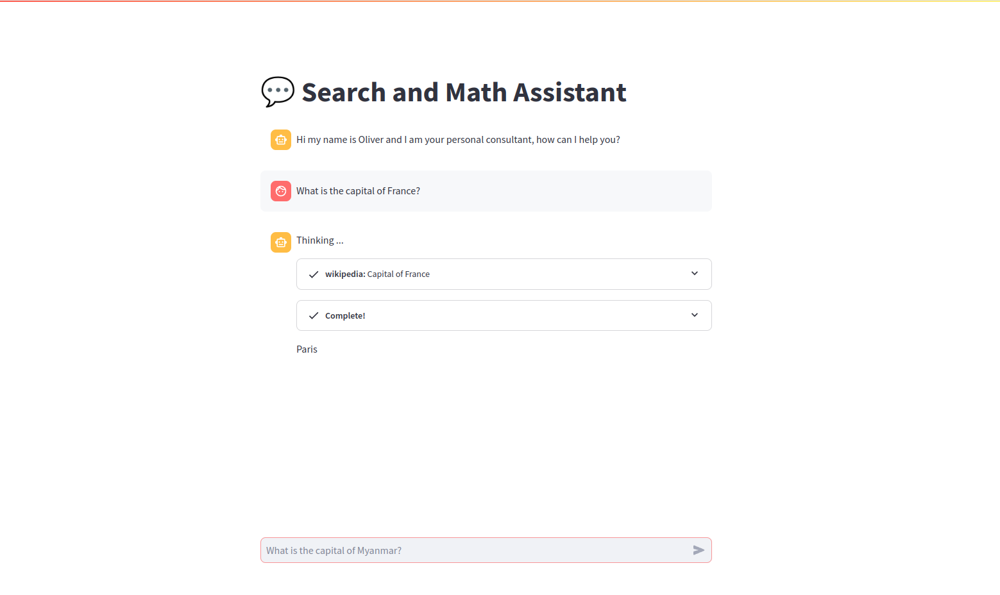

# LangChain Agent Demo

## Overview
This is a Streamlit-based demo application for the LangChain Agent using open-source Mistral-7b-instruct. The LangChain Agent is a conversational AI assistant capable of answering questions, providing information, and performing basic calculations. This demo allows users to interact with the agent in a chat-like interface.

## Demo

<table>
  <tr>
    <td align="center">
      
    <td align="center">
      
    </td>
  </tr>
</table>
